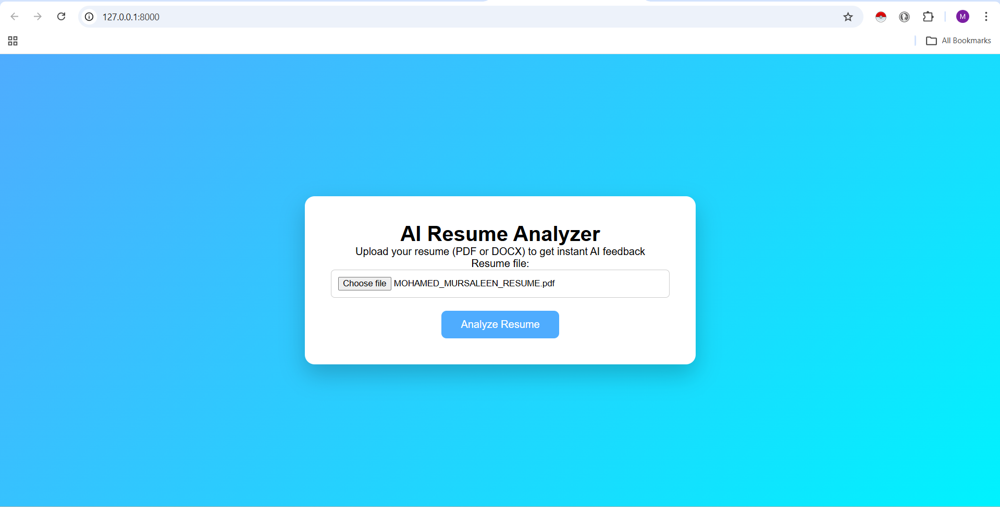
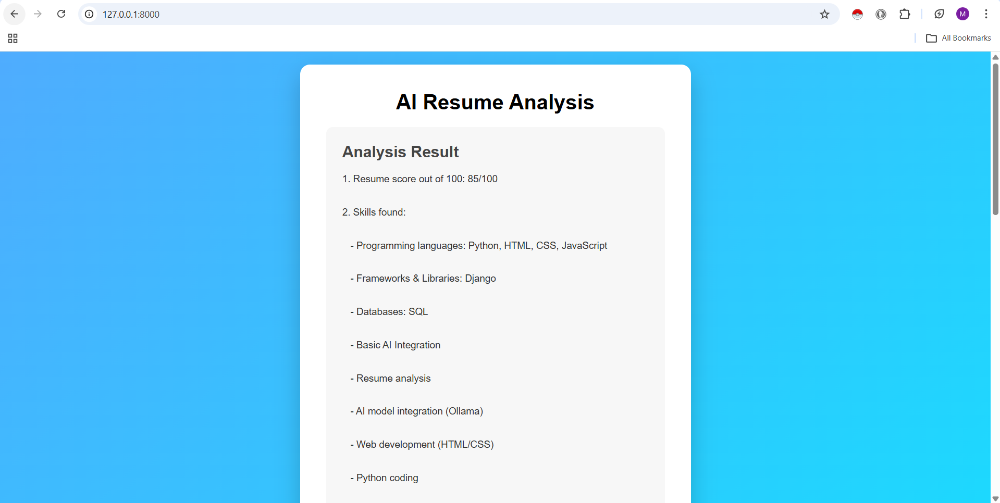
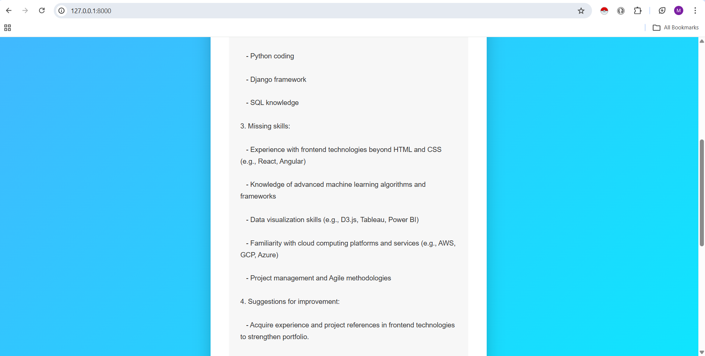
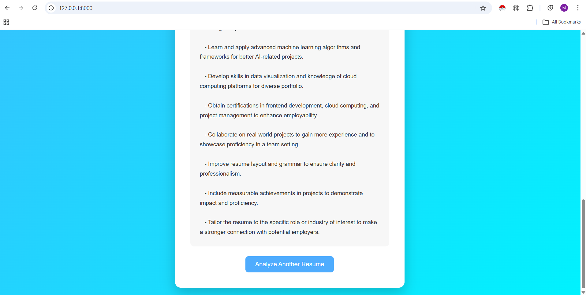

# AI Resume Analyzer

AI Resume Analyzer is a web-based application that allows users to upload their resumes (PDF or DOCX) and receive instant AI-powered feedback.  
The application uses **Ollama phi3 AI model** to analyze resumes and provides structured insights including skills, missing skills, suggestions, and an overall score.

---

## Features

- Upload **PDF or DOCX** resumes  
- Extract text from resumes using **PyPDF2** and **python-docx**  
- AI analysis using **Ollama phi3**  
- Provides:  
  - Resume score out of 100  
  - Skills found  
  - Missing skills  
  - Suggestions for improvement  
- Clean and responsive user interface with CSS  
- Easy to extend with more AI features  

---

## Technologies Used

- Python  
- Django  
- HTML & CSS  
- PyPDF2 (PDF parsing)  
- python-docx (Word parsing)  
- Ollama AI for analysis  

---

## Project Structure

ai_resume_analyzer/
│
├── analyzer/ # Main Django app
├── templates/ # HTML templates (upload & result)
├── static/ # CSS and static files
├── media/ # Uploaded resumes
├── manage.py # Django project manager
├── requirements.txt # Project dependencies
└── README.md # Project documentation

---

## Installation and Setup

Follow these steps to run the project locally.

### 1. Clone the Repository

git clone https://github.com/Mursaleen67/ai_resume_analyzer.git

## 2. Navigate to the Project Folder
cd ai_resume_analyzer

3. Create Virtual Environment & Activate
# Windows
python -m venv venv
venv\Scripts\activate

# macOS/Linux
python -m venv venv
source venv/bin/activate

## 4. Install Required Libraries
pip install -r requirements.txt

## 5. Apply Database Migrations
python manage.py makemigrations
python manage.py migrate

## 6. Run the Django Development Server
python manage.py runserver
## 7. Open the Application

Open your browser and go to:

http://127.0.0.1:8000

## Screenshots

### Upload Resume Page

### Analysis Result Page

## Future Improvements

- Display results in a structured table for better readability

- Add frontend frameworks like Bootstrap or Tailwind for modern UI

- Deploy the project online with Heroku / AWS

- Add history of analyzed resumes in a database

- Improve AI analysis with more advanced NLP models

## Author

**Mohammed Mursaleen**

## License

This project is created for learning and educational purposes using Python and Django. No official license is applied.